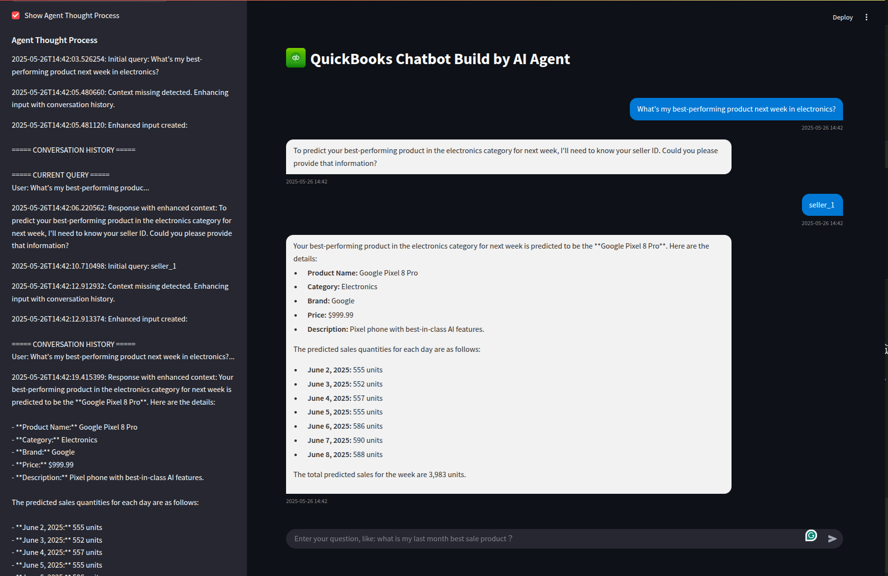

# Table of Contents

- [Product Sales Prediction System Design](#product-sales-prediction-system-design)
    - [A. Requirements Definition](#a-requirements-definition)
        - [Introduction](#introduction)
        - [Problem Statement](#problem-statement)
        - [Scope of the Problem](#scope-of-the-problem)
        - [High-Level Requirements](#high-level-requirements)
        - [Goals Breakdown](#goals-breakdown)
    - [B. QuickBooks Commerce predication System High Level Architecture](#b-quickbooks-commerce-predication-system-high-level-architecture)
        - [System Components](#system-components)
        - [Data Models](#data-models)
        - [Database Choices](#database-choices)
        - [Tech Stack choices and services](#tech-stack-choices-and-services)
    - [C. Machine Learning Platform Low Level Architecture](#c-machine-learning-platform-low-level-architecture)
        - [Feature Engineering](#feature-engineering)
        - [Candidate Models](#candidate-models)
        - [Data Simulation](#data-simulation)
        - [Training & Tuning](#training--tuning)
        - [Evaluation Metrics](#evaluation-metrics)
        - [Deployment & Integration](#deployment--integration)
    - [D. Predication Backend Microservices](#d-predication-backend-microservices)
        - [Service Function](#service-function)
        - [RESTful API Design](#restful-api-design)
        - [Model Context Protocol](#model-context-protocol)
    - [E. Agent + LLM + MCP Integration](#e-agent--llm--mcp-integration)
        - [Chatbot Workflow](#chatbot-workflow)
        - [LLM API usage](#llm-api-usage)
    - [F. Web UI and Dashboard](#f-web-ui-and-dashboard)
    - [G. Identity and Access Management](#g-identity-and-access-management)
    - [H. Cost Optimization / Performance & Latency / Accuracy](#h-cost-optimization--performance--latency--accuracy)
    - [I. Summary](#j-summary)


Hello, my name is Walter Chen. I’m a Senior Staff Software Engineer with over a decade of experience in backend architecture, AI system integration, and leading large-scale cross-functional initiatives. I hold a Master’s degree in Information Systems and Operations Management from the University of Florida.

Over the past few years, I’ve led end-to-end system design and development efforts in various domains such as fintech, real estate tech, and electric vehicles. At PayPal, I spearheaded the Fastlane product from conception to global launch, and Currently, I am primarily responsible for improving engineering productivity in PayPal's merchant integration by adopting AI technologies.

What truly excites me is the intersection of AI and system design. Since 2023, I’ve been deeply involved in AI development — I’ve built two personal AI-driven mini apps, one use llm index to build Rag for summarize and search connects from youtubes. I love building practical, scalable systems that bring intelligence into real-time applications. My passion lies in understanding how we can design intelligent agents that interact with users naturally and can reason through structured APIs to deliver business value.

🔹 Professional Achievements (10 minutes)
🏆 1. Fastlane End-to-End Development at PayPal
I led the E2E development of the Fastlane checkout product at PayPal — from the first design document to global GA rollout. This was a cross-functional effort involving frontend, backend, payment gateways, and legal compliance.

I drove architectural decisions, led sprint planning and delivery, and ensured cross-team alignment across multiple geos. After its launch, Fastlane scaled to serve millions of users, helping significantly improve conversion rates.

One of my proudest moments was driving the Vault optimization initiative as part of Fastlane. Initially, our Vault API success rate was at 99.8%. After a deep investigation into performance bottlenecks and several iterations of design and implementation, I improved the Vault success rate to 99.98%. That 0.18% may seem small, but at PayPal's scale, it translates to thousands of successful user checkouts per day.

🏆 2. AI Tool

We are building an AI tool that automatically analyzes JIRA ticket descriptions and application logs to identify the root cause of issues. Once the problem is understood, the system either suggests or directly applies the appropriate fix, and then responds to the JIRA ticket with a detailed resolution summary.

The goal is to significantly reduce mean time to resolution (MTTR), automate repetitive troubleshooting tasks, and allow engineers to focus on more complex and impactful work. By integrating with internal knowledge bases and historical tickets, the tool continuously learns and improves its accuracy over time.


# Product Sales Prediction System Design

---

## A. Requirements Definition

### ✅ Introduction

Designing a QuickBooks Commerce System for Top Sales by Category   
In this system design interview, we will focus on designing a feature for QuickBooks Commerce that
allows customers to easily determine their top sales by category. This feature is crucial for
businesses to understand which areas of their operations are most profitable or popular. By doing
so, businesses can make informed decisions on inventory management, pricing strategies, and
marketing efforts.   
Problem Statement   
QuickBooks Commerce users need an efficient way to forecast their top-selling products and amounts
across different categories. This feature should help users to better prepare and adjust their
business strategies accordingly.
Goal: Design a system that predicts the top sales by category for QuickBooks Commerce customers in
various time periods.
Scope of the Problem   
For the purpose of this interview, we will limit the scope of our design to the following:   
Service predicts the top sales by category over different selectable time frames, such as week,
month, or year.   
User views the top sales by category through a user-friendly interface.   
Service ensures high availability, accuracy and consistency.   
Out of Scope: The overarching QuickBooks Commerce platform and any unrelated features.

### ✅ Problem Statement

- QuickBooks Commerce users need an efficient way to forecast their top-selling products and amounts
  across different categories.
- This feature should help users to better prepare and adjust their business strategies accordingly.

### ✅ High-Level Requirements

- Predict top-N selling products using AI/ML based on historical and contextual signals
- Provide a user-friendly dashboard and chatbot for seller-side access
- Ensure system scalability, reliability, observability

### ✅ Goals Breakdown

#### 📝 Business Objectives

- **Inputs:**
    - Seller ID
    - Product Category
    - Time Range (e.g. next week/month/year)
    - Top-N value

- **Output:**
    - Ranked list of predicted top-selling products with estimated quantities

- **User Scenario:**  
  A seller wants to know what products will perform best next week in "Electronics" category. They
  log into QuickBooks, input category and time range, and get predictions to support marketing
  decisions.

- **Service Scale:**
    - ~10,000 sellers × 1,000 daily orders → 10M orders/day
    - ~100 requests/sec at peak (holiday seasons)
    - 10k seller, every use has 10 request per day, 1 requests per second.

- **Data Sources:**
    - Historical order data
    - Product metadata
    - Seller-product relationships

#### 📌 AI Application Points

- Supervised regression or time-series forecasting models for product-level sales
- LLM + Agent for natural-language UX & Traditional dynamic dashboard queries

---

## B. QuickBooks Commerce Predication Platform High Level Design.

### B.1 High Level Architecture


### B.2 Data Models

```java

@Entity
@Data
@NoArgsConstructor
@AllArgsConstructor
@Builder
@Table(name = "orders")
public class Order {

  @Id
  private String orderId;

  private String productId;
  private String buyerId;
  private String sellerId;

  private Double unitPrice;
  private Integer quantity;
  Low Level
  Architecture
/**
 * @author cicidi on 5/23/25
 */
  @Data
  @Builder
  @NoArgsConstructor
  @AllArgsConstructor

  public class Predications {

    private String productId;
    private List<Predication> predicationList;
    private LocalDate startDate;
    private LocalDate endDate;
    private int totalQuantity;
    private int totalDays;
  }

```

```java
package com.example.productapi.model;

import java.time.LocalDate;
import lombok.AllArgsConstructor;
import lombok.Builder;
import lombok.Data;
import lombok.NoArgsConstructor;

/**
 * @author cicidi on 5/23/25
 */
@Data
@Builder
@NoArgsConstructor
@AllArgsConstructor
public class Predication {

  private LocalDate date;
  private int quantity;
}

```

```java
package com.example.productapi.model;

import jakarta.persistence.Table;
import lombok.AllArgsConstructor;
import lombok.Builder;
import lombok.Data;
import lombok.NoArgsConstructor;

import jakarta.persistence.Entity;
import jakarta.persistence.Id;
import jakarta.persistence.Column;
import jakarta.persistence.Lob;
import jakarta.persistence.Transient;
import java.time.LocalDateTime;
import java.util.List;

@Entity
@Data
@NoArgsConstructor
@AllArgsConstructor
@Builder
@Table(name = "product")
public class Product {

  @Id
  private String id;

  private String name;
  private String category;
  private String brand;
  private Double price;

  @Column(name = "create_timestamp")
  private LocalDateTime createTimestamp;

  @Column
  private String description;
}
```

## B.3 Database Choices

Here is the database choices for different types user case

| Characteristic     | SQL DB                                             | Vector DB Cache                                              | NoSQL DB Cache                                                             | Redis Cache                                           |
|--------------------|----------------------------------------------------|--------------------------------------------------------------|----------------------------------------------------------------------------|-------------------------------------------------------|
| **Data Model**     | Relational tables of request keys + resultst       | High‑dimensional vectors with metadata                       | Key‑value or JSON document store                                           | Key Value Store                                       |
| **Latency**        | Very low (< 1 ms)                                  | Low‑medium (~ 2–5 ms)                                        | Very low (< 1 ms)                                                          | Very low (< 1 ms)                                     |
| **Scalability**    | Moderate; requires sharding/partitioning           | High; built for horizontal scaling of vector shards          | High; built‑in sharding & replication                                      | High; built‑in sharding & replicatio                  |
| **Consistency**    | Strong ACID                                        | Eventual consistency                                         | Configurable (strong or eventual)                                          | Eventual or strong (via Redis config)                 |
| **Storage & Cost** | Medium (only hot rows cached)                      | High (vector indexes + metadata)                             | Low (simple key‑value storage)                                             | Very low (in-memory, volatile unless persisted)       | 
| **Best Use Case**  | Store Production Orders, Product relational data   | Fuzz Search for similar product and Cache LLM Query Response | Ready only Order history, and Prepared Training data. <br/> Large data set | Real-time session, token, feature cache , idempotency |
| **Limitations**    | No semantic lookup; large tables can degrade perf. | Complex index maintenance; higher write/storage cost         | No built‑in approximate search                                             | Volatile by default; persistence optional             |

## B.4 Tech Stack choices and services

1. `product-sale-prediction-AI`: Simulated data, XGBoost model training, deployment
2. `product-sale-prediction-service`: SpringBoot + Postgres + REST/MCP backend with scalable APIs
3. `quickbooks-sales-dashboard`: Angular app for filtering and visualizing predictions
4. `ai_chat_bot`: LangChain + MCP + LangSmith + Streamlit to query forecasts via chat
5. `Monitoring tools`: Datadog / Prometheus for latency, Langsmith.

## C. Machine Learning Platform Low Level Architecture

### C.1 Feature Engineering

| Feature                    | Description                            |
|----------------------------|----------------------------------------|
| `product_id`               | Unique ID for product                  |
| `seller_id`                | Seller who sold the product            |
| `sale_price`               | Final transaction price                |
| `original_price`           | Price before discount                  |
| `is_holiday`               | Whether the sale happened on a holiday |
| `is_weekend`               | Weekend indicator (Saturday/Sunday)    |
| `day_of_week`              | Day of week (0–6)                      |
| `day_of_month`             | Day of month (1–31)                    |
| `month`                    | Month (1–12)                           |
| `lag_1`, `lag_7`, `lag_30` | Aggregated past sales quantities       |

### C.2 Candidate Models

- **Tree-based models (XGBoost, LightGBM)**
    - Good for structured, categorical + numeric data

### C.3 Data Simulation

📈 Quantity Simulation Logic

`quantity` is a function of several features:

| Feature                          | Effect on Quantity                                      |
|----------------------------------|---------------------------------------------------------|
| `sale_price` vs `original_price` | Greater discount → higher quantity (up to 20% discount) |
| `is_holiday`                     | Boosts electronics and clothes sales                    |
| `is_weekend`                     | Boosts food sales significantly                         |
| `product_id`                     | Different base rates, all balanced                      |
| `seller_id`                      | Large sellers have slightly higher volume               |
| `day_of_week`                    | Captures weekday/weekend patterns                       |
| `day_of_month` / `month`         | Reflect seasonal/monthly variations                     |

[Simulation Requirment](./product-sale-prediction-AI/generate/sales_data_specification.md) / [generate_test_data.py](product-sale-prediction-AI/generate/generate_test_data.py)

### C.4 Training & Tuning

1. Data aggregation  (daily quantity per product per
   seller)   [prepare_sales_train_data.py](product-sale-prediction-AI/train/prepare_sales_train_data.py)
   other options:
    - **Sales Aggregator** — Kafka + Spark-based data preprocessing pipeline
    - **Batch ETL** — Periodic aggregation jobs using Airflow or similar tools
    - **Data Lake** — Store raw logs in S3 or HDFS for future analysis
2. Feature generation(lags, date features,
   flags)   [prepare_sales_train_data.py](product-sale-prediction-AI/train/prepare_sales_train_data.py)
3. Evaluation: Quantity Precision vs Real
   data.  [evaludate_model.py](product-sale-prediction-AI/evaluate/evaludate_model.py)  
   

### C.5 Evaluation Metrics

- **MAE [evaludate_model.py](product-sale-prediction-AI/evaluate/evaludate_model.py) (Mean Absolute
  Error)**
- **RMSE (Root Mean Square Error)**
- **Precision@N / Recall@N** for top-N product list  
  

### C.6 Deployment & Integration

- **API Endpoint:**
  `POST /predict` [doc] (http://localhost:8000/docs#/default/predict_single_predict_post)
- **Input JSON:**
  ```json
  {
  "product_id": "p101",
  "seller_id": "seller_2",
  "sale_price": 899.99,
  "original_price": 1099,
  "is_holiday": 0,
  "is_weekend": 1,
  "day_of_week": 6,
  "day_of_month": 15,
  "month": 5,
  "lag_1": 120,
  "lag_7": 89,
  "lag_30": 95
  }
  ```  
- **Output JSON:**
  ```json
  {
  "predicted_quantity": 593.7947998046875,
  "status": "success"
  }
  ```  

- **Machine Learning Deployment Options:**  
  FastAPI [sales_prediction_api.py](product-sale-prediction-AI/sales_prediction_api.py), Spring Boot
  or AWS SageMaker.

      

---

## D. Predication Backend Microservices(Orchestration and Integration) Low Level Architecture

### D.1 Service Function

- **Access control** — Check if seller able to access API resource, and seller can only access their
  own products.
- **Integrate Other Services**
    - **Integrate Prediction Model Service** — Call `/predict` endpoint with product features
    - **Seller Context Service** — Fetch seller metadata (e.g. seller_id, seller is selling which
      products, etc.)
    - **Product Details Service** — Fetch product descriptions, category, etc.
    - **Sales History Service** — Retrieve historical sales data for feature generation
- **Model Context Protocol** — Standardized API for model interactions, allowing easy swapping of
- **Restful API** — Use RESTful endpoints for model predictions, allowing easy integration with
- **Caching**: **Cache recent queries & deduplicated predictions

### D.2 RESTful API Design

Swagger Doc http://localhost:8080/swagger-ui/index.html#

| name             | Endpoint           | Description                                                                                                                                                                      |
|------------------|--------------------|----------------------------------------------------------------------------------------------------------------------------------------------------------------------------------|
| `Products API`   | /products /product | Product management endpoints.  list product, search prodcut by productid and/or category and/or seler_id                                                                         |
| `Orders API`     | /orders?sellerId=  | Retrieve orders with optional filters for seller ID, product ID, category, date range. Results are sorted by timestamp in descending order. Default returns last 30 days orders. |
| `Predicate API`  | /salles/predicate  | Predict future sales for a specific product using historical data and ML model                                                                                                   |
| `Analystics API` | /sales/analystics  | Get daily product sales summary and total summary for a time range. If topN is provided, returns only top N products by total sales.                                             |

### D.2  Model Context Protocol

Model-Context Protocol (MCP) is a tool invocation interface provided for large language models (
LLMs), enabling AI models to call various functions through a standardized protocol, such as product
sales analysis and sales prediction.
This API design follows a tool-centric approach, modularizing system functions into independently
callable "tools", allowing large models to flexibly combine and call them based on requirements.
[mcp-docs.md](product-sale-prediction-service/src/main/resources/static/mcp-docs.md)

| Endpoint                | Description                                                                      |
|-------------------------|----------------------------------------------------------------------------------|
| `predict_by_category`   | Predict future Top/Best N sell products within a specific category.              |
| `predict_by_product_id` | Predict future sales for a specific product by product ID.                       |
| `list_orders`           | Query order records for a specific seller, supporting time range and pagination. |
| `list_products`         | List products with optional filtering by category and seller ID..                |
| `manage_product`        | Get detailed information about a specific product.                               |
| `analyze_sales`         | Get daily product sales summary and total summary for a time range.              |

Sample Question Supported:

``` 
- List all orders for seller_3 in the last month.
- Predict seller_1's future sales for product p100 in next 10 days.
- What are the details of product ID p101?
- Predict the seller 2 's top 3 selling electronics next week.
- List all products for seller_5.
- Update the price of product ID p300 to 135.0.
- What is the total revenue for seller_3 in the last quarter?
- How many units of product ID p200 were sold by seller_1 last month?
- What are the top 5 best-selling products this year?
- What is the average order value for seller_4?
```

---

## E. Agent + LLM + MCP Integration

LLM agents can be used to provide a natural language interface for querying product sales
predictions.
Functionalities include:

- **Natural Language Understanding**: Parse user queries to identify intent and parameters
- **Tool Invocation**: Call appropriate MCP endpoints based on parsed intent
- **Context Management**: Maintain conversation state and context for follow-up questions
- **Error Handling**: Gracefully handle invalid inputs or API errors
- **Response Generation**: Format API responses into natural language summaries


<br>
### E.1 Chatbot Workflow

User types:
> "What's my best-performing product next week in electronics?"

Agent thinking Steps:

1. What is the Question ask me to do? -> predict_by_category
2. What is the MCP required input parameter? -> ( seller_id, category, startTime,endTime, top_n)
3. "Next Week" is not validate input -> "What is the time range?"
4. Call "convert_time_range" tool to convert "next week" to a "startTime" + "endTime" range.
5. Seller ID is not provided -> ask user "What is your seller" -> User reply "seller_1"
   -> fill in seller_id
6. But if we just tell LLM "seller_1", AI will ask :"What do you want to do with "seller_1" ? let me check history. 
7. History found, "What's my best-performing product next week in electronics + seller_1 + start/end time". Fills in missing info (e.g. `seller_id`, `category`)
8. Calls `/mcp/sales/predict`
9. Returns conversational summary with top-N products and explanations
10. If user next more details on product, call `/mcp/sales/manage_product` to get product details

### E.2 LLM API usage

As LLM as high cost and long latency, we need a monitoring to track the usage and performance of LLM
API calls.
By learning from the usage patterns, we can optimize the LLM calls to reduce cost and improve
performance in the following ways:

- **Rate Limiting**: Throttle LLM calls to avoid overuse
- **Chunking**: Understand and Break down large queries into smaller parts to reduce token usage
- **Caching**: Cache common queries and responses to reduce redundant LLM calls

https://smith.langchain.com/o/ae357598-8cdb-481a-96a8-c2db51f867d5/dashboards/projects/f59f2388-4243-4c1f-9cc8-a6c345592242


## F. Web UI and Dashboard

Even we have a chatbot interface, we still need a web UI to provide a more visual and interactive.
dashboard for sellers to view and filter predictions.

http://localhost:4200/dashboard


## G. Identity and Access Management (not implemented yet)

To ensure secure access to the prediction APIs, we need implement an Identity and Access
Management (IAM)

- **Roles and Permissions**: system to control who can access which resources.
- **ClientID** and **ClientSecret**: are used to authenticate the client application, and return *
  *AccessToken**
- **AccessToken**: is a temporary JWT token that contains the user's identity and permissions.

## H. Cost Optimization / Performance & Latency / Accuracy

- LLM agent Cost and performance Optimization
    - User Rag to store and retrieve common queries
    - User Rag to store and retrieve chat history and context , currently use entire chat history,
      but can
      be optimized to only store the last 10 messages.
    - Different model for different user, e.g. use a smaller model for low-traffic sellers. or
      smaller model for convert time range.
    - Use open-source LLMs (e.g. Llama 2, Falcon) for cost-sensitive applications
    - User prompt engineering to reduce token usage, reject irrelevant queries, and avoid
      unnecessary LLM calls, reply message in short and concise.

- Web Service Cost/Latency Optimization
    - Dynamic scaling of microservices based on traffic
    - User Caching.

- Database Cost/Latency Optimization
    - Use Redis for caching frequently accessed data (e.g. product details, seller metadata)
    - Use database indexing for faster query performance
    - Use partitioning to scale database horizontally
    - Use read replicas to distribute read traffic
- Machine Learning Model accuracy
    - Use XGBoost or LightGBM for structured data
    - Use feature engineering to improve model performance
    - Use hyperparameter tuning to optimize model performance
    - Use cross-validation to evaluate model performance
    - Use SHAP values to explain model predictions
    - Early Stopping
    - Online Learning / Active Learning

- Use historical grouping to reduce compute cost for low-traffic sellers
---

## J. Summary

In this project, I have designed and implemented a product sales prediction system for QuickBooks
Commerce. all requirements are met, including:

- Practical AI integration.
- Real-time, explainable outputs
- Scalable microservices and chat interfaces
- Monitoring and fallback strategies for robustness

I have been working very hard on this project, building 4 projects, 27k lines of code by myself, in one
week.

- Used: Java, Python, Angular, Machining Learning, LLM.
- Added: 18829 Deleted: 8637 Total Changed: 27466

```shell
 git log --pretty=tformat: --numstat | grep -E '\.(java|ts|py|md)$' | awk '{ added += $1; deleted += $2 } END { print "Added:", added, "Deleted:", deleted, "Total Changed:", added + deleted }'
```
